# Оптимизация хэш таблицы #
## 1. Аннотация ##
В этой работе я исследую 7 различных хэш функций на оптимальность распределения по bucket'ам. Далее я попытаюсь оптимизировать свой код с помощью ассемблерных вставок, выявив наиболее долгие по времени работы функции.

Будут предложены следующие хэш функции:

1. Константный хэш
2. Хэш, равный длине слова
3. Хэш, возвращающий ASCII код 1-го символа
4. Контрольное сумма (сумма ASCII кодов)
5. ROR-Hash
6. ROL-Hash
7. CRC32

Работа хэш функций проверяется с помощью англо-русского словаря. Для анализа наиболее медленных функций используется [Callgrind profile with KCacheGrind](https://baptiste-wicht.com/posts/2011/09/profile-c-application-with-callgrind-kcachegrind.html).

## 2. Исследование хэш функций ##

Алгоритм работы хэш таблицы:
1. Читаем слово из словаря
2. Для каждого слова вычисляем хэш
3. Добавляем по вычисленному хэшу наш элемент в хэш таблицу
4. Если по данному хэшу уже есть элемент, то привязываем наш элемент к последнему в данном bucket'е

Для лучшего понимания можно посмотреть сюда:


### 2.1. Константный хэш ###

Хэш всегда возвращает 1.

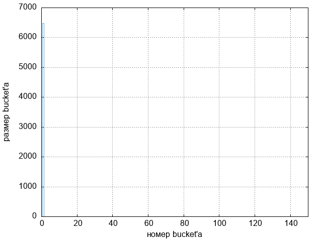
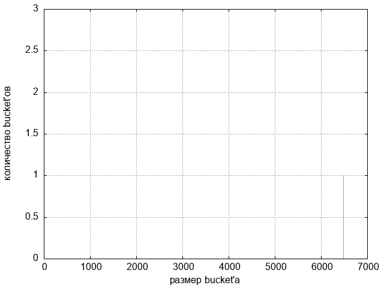

Масштаб по оси x увеличен в 30 раз, чтобы лучше было видно пик.

### 2.2. Хэш, равный длине слова ###

Хэш функция возвращает длину элемента (слова).

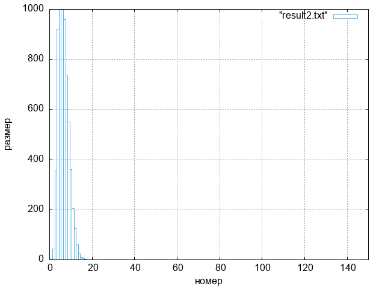
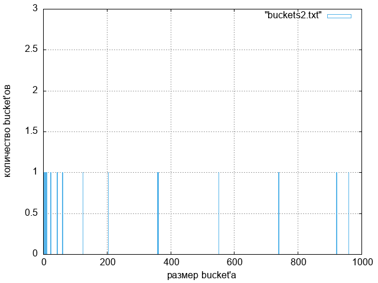

Масштаб по оси x увеличен в 30 раз, чтобы лучше было видно пик.

### 2.3. Хэш, возвращающий ASCII код 1-го символа ###

Хэш функция возвращает ASCII код 1-го символа.

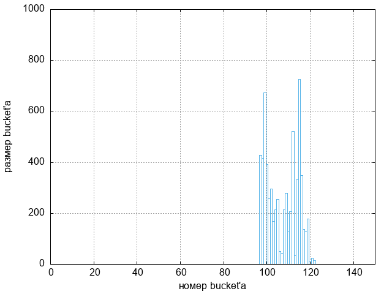
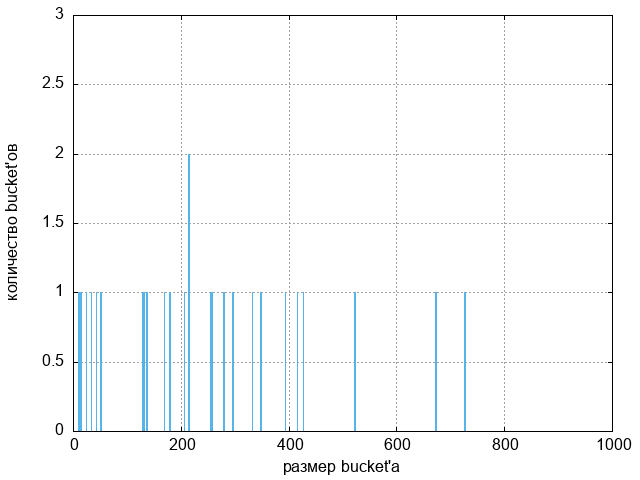

Масштаб по оси x увеличен в 30 раз, чтобы лучше было видно пик.

### 2.4. Контрольное сумма ###

Хэш функция возвращает сумму ASCII кодов всех символов слова.

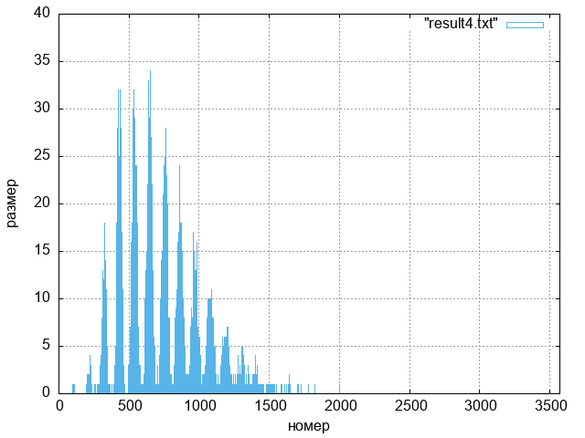
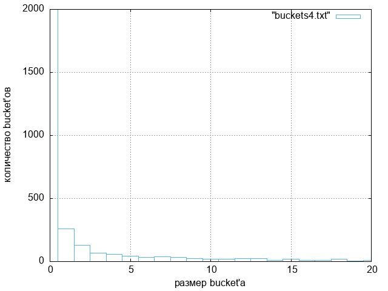

### 2.5. ROR хэш ###

Hash[0] = 0

Hash[i + 1] = ror Hash[i] xor String[i]

Хэш функция возвращает xor слова с его цикличиским побитовым сдвигом вправо.

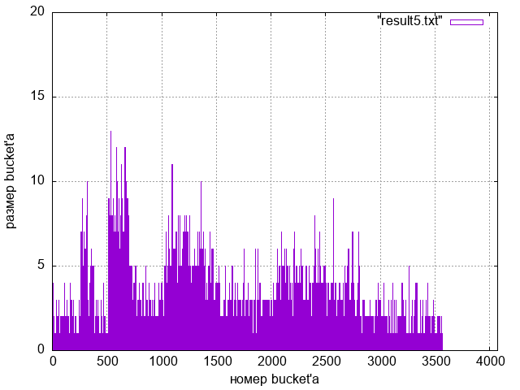
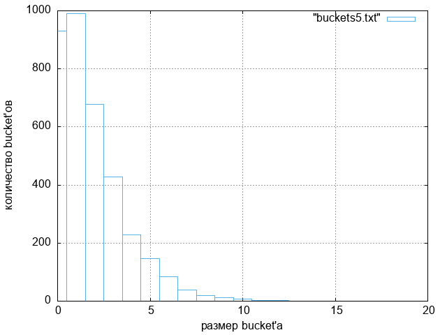

### 2.6. ROL хэш ###

Hash[0] = 0

Hash[i + 1] = rol Hash[i] xor String[i]

Хэш функция возвращает xor слова с его цикличиским побитовым сдвигом влево.

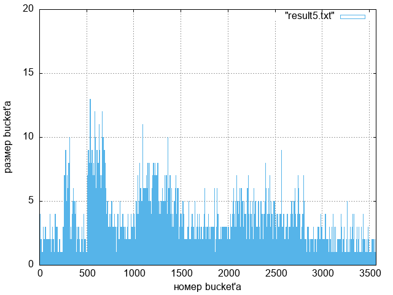
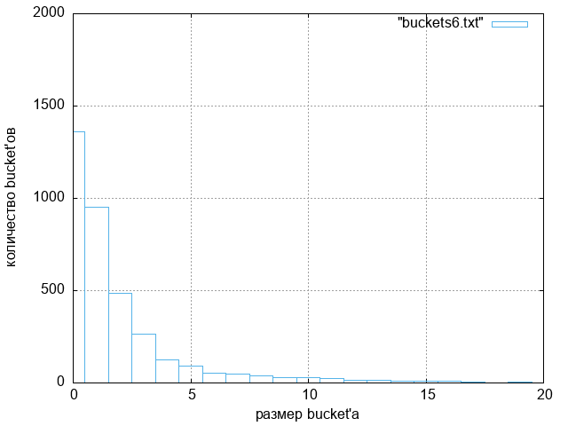

### 2.7. CRC32 ###

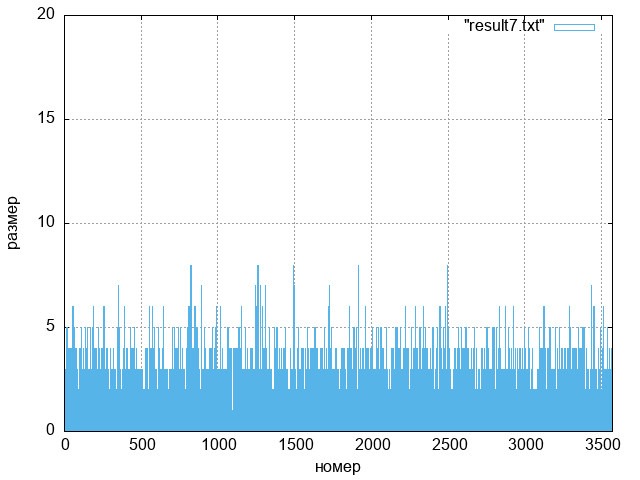
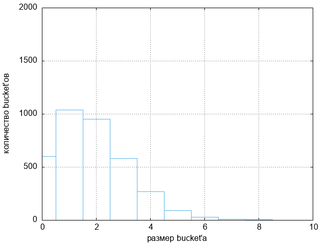

### 2.8. Выбор наиболее оптимальной хэш функции ###

Как видно из графиков, CRC32 является наиболее эффективной хэш функцией. В ней наименьшее количество пустых bucket'ов, наиболее равномерное распределение элементов по bucket'ам и размер bucket'а составляет не больше 9-ти элементов. 

Если же смотреть на остальные хэш функции, то можно сказать, что первые четыре хэш функции имеют множество пустых bucket'ов, к тому же у них много высоких пиков, они совсем не подходят для эффективного поиска в хэш таблице.  6-я и 7-я хэш функции уже получше, в них значительно меньше пустых bucket'ов, однако в ROR хэше имееются bucket'ы размера больше 9, а распределение элеметов не такое равномерное как у  CRC32 (у ROL хэша такие же проблемы, только более усугбленные).

## 3. Анализ времени работы функций ##

Для того чтобы понять, какие функции хэш таблицы занимают наибольшее время работы, будем много раз находить перевод каждого слова в большом тексте. Теперь можно посмотреть на время работы, используя callgrind. 

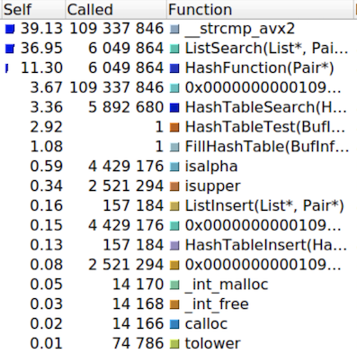

Теперь видно, что наиболее долгие по времени работы функции - это ListSearch(который содержит в себе __strcmp_avx2) и HashFunction. Их мы и будем оптимизировать.

## 4. Оптимизация ##

Измерим время работы программы без оптимизаций c -O0 и с -O3 для дальнейших сравнений.

| -O0, с   | -O3, c   |
|----------|----------|
| 6.803562 | 4.086374 |

### 4.1. ListSearch ###

Давайте поймем, как работает функция ListSearch. Она получает на вход bucket и элемент, который в этом bucket'е нужно найти. Далее она проходится по всем элементам и сравнивает их с помощью встроенного strcmp, пока не найдет запрашиваемый элемент. Таким образом, чтобы оптимизировать ListSearch, нам нужно написать свою функцию сравнения строк, так как strcmp неэффективен.

Для этого есть хорошее решение - мы можем использовать AVX инструкции! А теперь поподробнее. Заметим, что наши слова не превышают в размере 32-х байт. Тогда мы можем хранить ключевые слова в переменных типа __m256i. Теперь сравнение двух строк превращается в сравнение двух переменных __m256i, которое выполняется всего лишь одной инструкцией _mm256_cmpeq_epi8. Перепишем на ассемблере функцию ListSearch, используя векторные инструкции.

```asm
_ListSearch:  mov rax, [rdi]     
              mov rcx, [rdi + 8] 

              vmovdqu ymm0, [rsi]

loop_start:   or rcx, rcx
              jz exit_false

              vmovdqu ymm1, [rax]
              vpcmpeqb ymm2, ymm1, ymm0
              vpmovmskb rdx, ymm2

              cmp rdx, -1
              je exit_true

              add rax, 16
              dec rcx
              jmp loop_start

exit_false:   xor rax, rax
              ret

exit_true:    mov rdx, [rsi + 8]
              mov [rax + 8], rdx
              mov rax, 1
              ret

```

Измерим время работы после данной оптимизации.

| -O0, с   | -O3, c   |
|----------|----------|
| 4.439435 | 3.695601 |

Таким образом, мы получили ускорение при -O0 на 53% и при -O3 на 11%

### 4.2. HashFunction ###

Теперь нам нужно оптимизировать CRC32. Для этого в ассемблере существует встроенная инструкция по вычислению CRC32.  

```c
size_t HashFunction(Pair* pair) {
  size_t result = 0;

  __asm__ (
    ".intel_syntax noprefix \n\t"
    "xor rax, rax           \n\t"
    "mov rdx, [rdi]         \n\t"
    "loop_start:            \n\t"
    "mov cl, [rdx]          \n\t"
    "or cl, cl              \n\t"
    "jz loop_end            \n\t"
    "crc32 rax, cl          \n\t"
    "inc rdx                \n\t"
    "jmp loop_start         \n\t"
    "loop_end:              \n\t"
    ".att_syntax            \n\t"
    : "=a"(result)
    :
    : "rcx", "rdx", "rdi"
  );

  return result;
}
```

Измерим время работы после данной оптимизации.

| -O0, с   | -O3, c   |
|----------|----------|
| 3.463982 | 3.373021 |

Таким образом, мы получили ускорение при -O0 на 28% и при -O3 на 10%

 ## 5. Заключение ##

  Наконец-то, давайте сравним время работы нашей изначальной хэш таблицы (без каких-либо оптимизаций) и оптимизированной хэш таблицы. 

|                                                     | -O0, с   | -O3, c   |
|-----------------------------------------------------|----------|----------|
| Без оптимизаций                                     | 6.803562 | 4.086374 |
| ListSearch + AVX инструкции                         | 4.439435 | 3.695601 | 
| ListSearch + AVX инструкции + СRC32 оптимизированный| 3.463982 | 3.373021 |

 В итоге мне удалось повысить производительность хэш таблицы на 96% (с -O0) и на 21% (с -O3). 

Осталось посчитать коэффициент ded32 [🙀](https://static.probusiness.io/n/03/d/38097027_439276526579800_2735888197547458560_n.jpg)[🙀](https://ru.meming.world/images/ru/thumb/e/ef/%D0%9F%D0%BB%D0%B0%D1%87%D1%83%D1%89%D0%B8%D0%B9_%D0%BA%D0%BE%D1%82_%D1%81_%D0%BF%D0%B0%D0%BB%D1%8C%D1%86%D0%B5%D0%BC_%D0%B2%D0%B2%D0%B5%D1%80%D1%85_%D1%88%D0%B0%D0%B1%D0%BB%D0%BE%D0%BD.jpg/300px-%D0%9F%D0%BB%D0%B0%D1%87%D1%83%D1%89%D0%B8%D0%B9_%D0%BA%D0%BE%D1%82_%D1%81_%D0%BF%D0%B0%D0%BB%D1%8C%D1%86%D0%B5%D0%BC_%D0%B2%D0%B2%D0%B5%D1%80%D1%85_%D1%88%D0%B0%D0%B1%D0%BB%D0%BE%D0%BD.jpg)[🙀](https://www.interfax.ru/ftproot/textphotos/2019/05/17/700gc.jpg):

boost_coefficient / #asm_lines * 1000 = 1,96 / 37 * 1000 = 53,1 (-O0)

boost_coefficient / #asm_lines * 1000 = 1,21 / 37 * 1000 = 32,7 (-O3)
