# Hash Table Optimization #
## 1. Abstract ##
In this paper, I investigate 7 different hash functions for optimal bucket distribution. Next, I will attempt to optimize my code using inline assembly, having identified the most time-consuming functions.

The following hash functions will be proposed:

1. Constant hash
2. Hash equal to word length
3. Hash returning the ASCII code of the 1st character
4. Checksum (sum of ASCII codes)
5. ROR-Hash
6. ROL-Hash
7. CRC32

The performance of the hash functions is tested using an English-Russian dictionary. To analyze the slowest functions, [Callgrind profile with KCacheGrind](https://baptiste-wicht.com/posts/2011/09/profile-c-application-with-callgrind-kcachegrind.html) is used.

## 2. Investigation of Hash Functions ##

Hash table algorithm:

1. Read a word from the dictionary
2. Calculate the hash for each word
3. Add our element to the hash table based on the calculated hash
4. If there is already an element at this hash, we append our element to the last one in the given bucket

For a better understanding, you can look here:

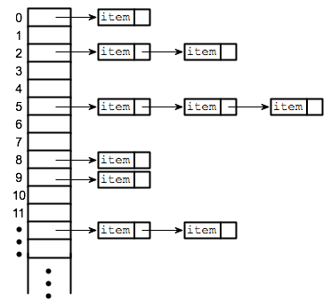

**Figure 1.**

### 2.1. Constant Hash ###

The hash always returns 1.

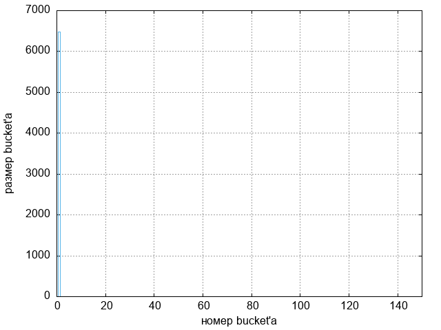

**Figure 2.1.1.**
**Dependence of the number of elements in a bucket on the bucket number.**

The scale on the x-axis is increased 30 times to make the peak more visible.

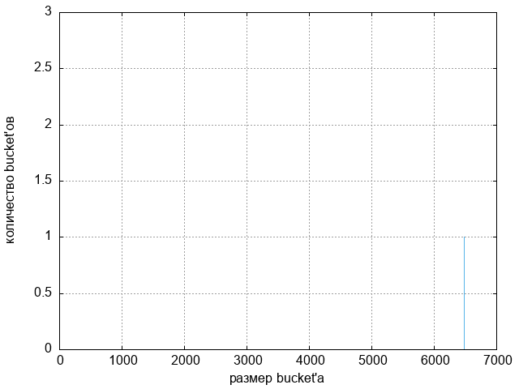

**Figure 2.1.2.**
**Distribution.**

### 2.2. Hash Equal to Word Length ###

The hash function returns the length of the element (word).

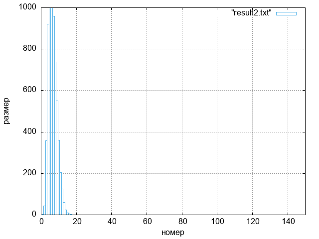

**Figure 2.2.1.**
**Dependence of the number of elements in a bucket on the bucket number.**

The scale on the x-axis is increased 30 times to make the peak more visible.

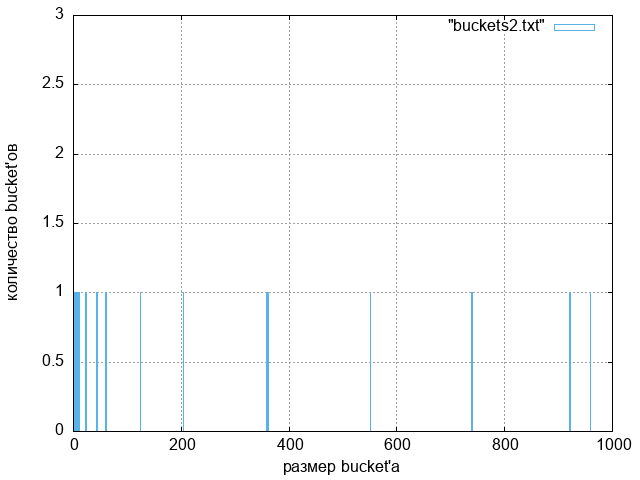

**Figure 2.2.2.**
**Distribution.**

### 2.3. Hash Returning the ASCII Code of the 1st Character ###

The hash function returns the ASCII code of the 1st character.

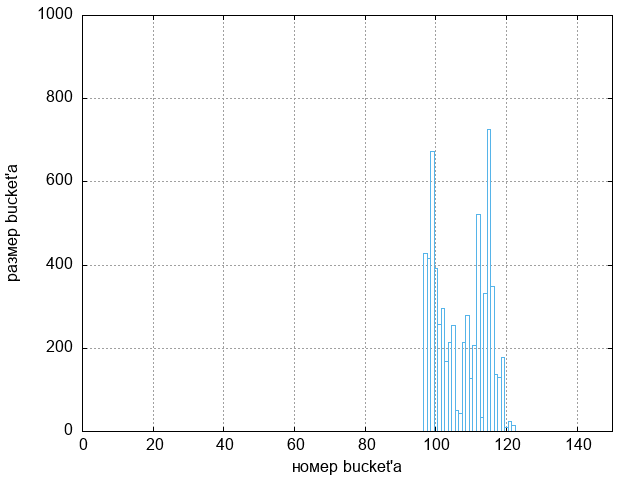

**Figure 2.3.1.**
**Dependence of the number of elements in a bucket on the bucket number.**

The scale on the x-axis is increased 30 times to make the peak more visible.

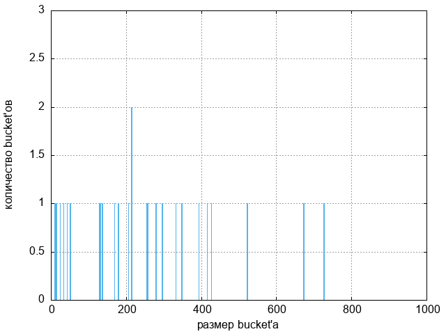

**Figure 2.3.2.**
**Distribution.**

### 2.4. Checksum ###

The hash function returns the sum of the ASCII codes of all characters in the word.

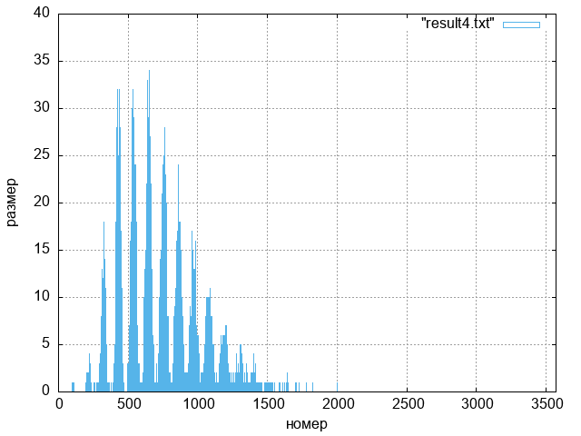

**Figure 2.4.1.**
**Dependence of the number of elements in a bucket on the bucket number.**

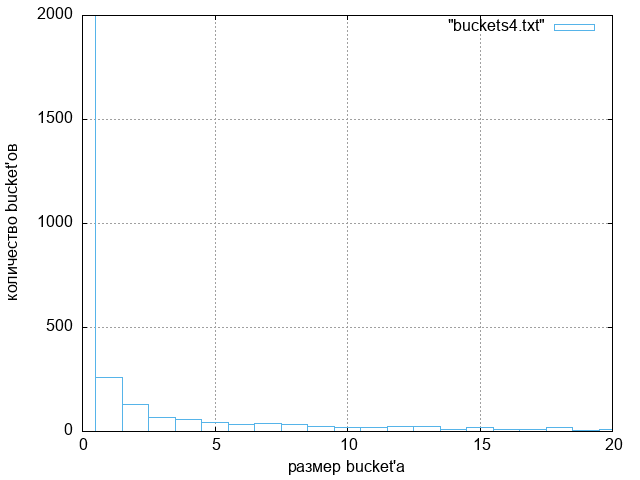

**Figure 2.4.2.**
**Distribution.**

### 2.5. ROR Hash ###

Hash[0] = 0

Hash[i + 1] = ror Hash[i] xor String[i]

The hash function returns the XOR of the word with its cyclic bitwise right shift.

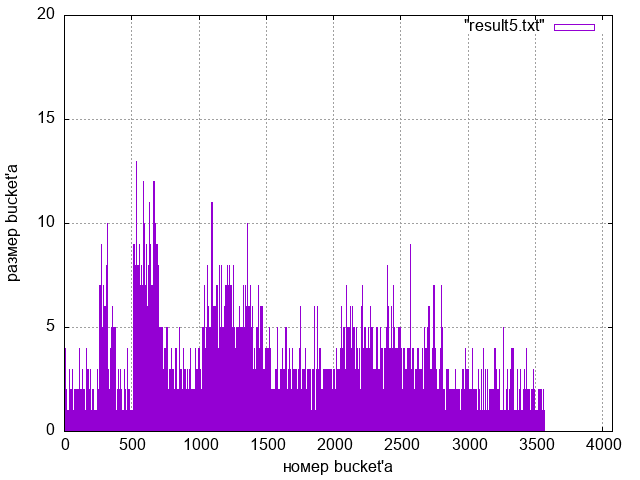

**Figure 2.5.1.**
**Dependence of the number of elements in a bucket on the bucket number.**

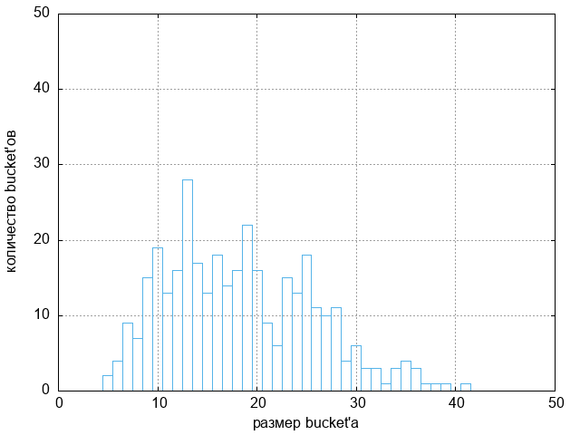

**Figure 2.5.2.**
**Distribution.**

For clarity, the size of the hash table was reduced by 10 times (for denser bucket filling).

### 2.6. ROL Hash ###

Hash[0] = 0

Hash[i + 1] = rol Hash[i] xor String[i]

The hash function returns the XOR of the word with its cyclic bitwise left shift.

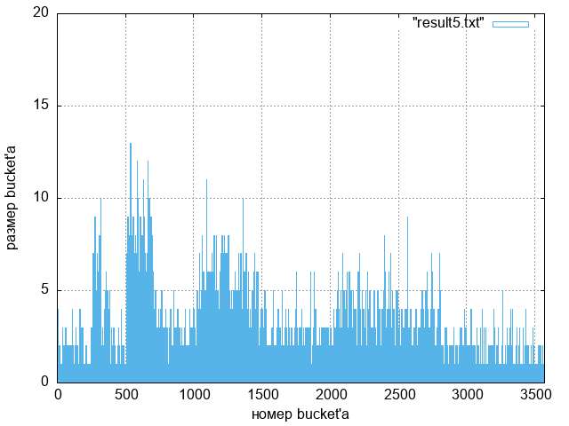

**Figure 2.6.1.**
**Dependence of the number of elements in a bucket on the bucket number.**

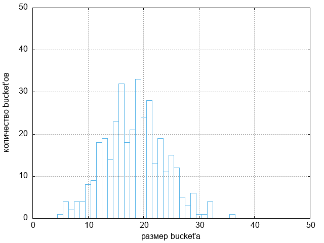

**Figure 2.6.2.**
**Distribution.**

For clarity, the size of the hash table was reduced by 10 times (for denser bucket filling).

### 2.7. CRC32 ###

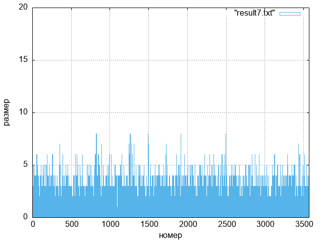

**Figure 2.7.1.**
**Dependence of the number of elements in a bucket on the bucket number.**

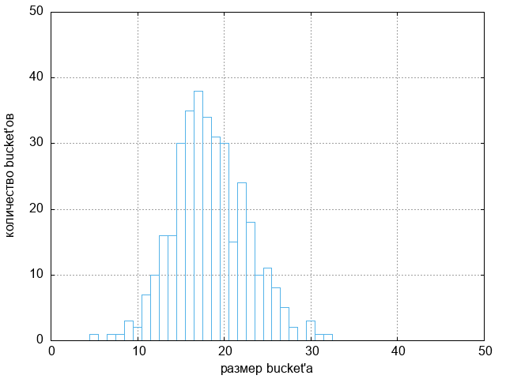

**Figure 2.7.2.**
**Distribution.**

For clarity, the size of the hash table was reduced by 10 times (for denser bucket filling).

### 2.8. Choosing the Most Optimal Hash Function ###

As can be seen from the graphs, CRC32 is the most effective hash function. It has the smallest number of empty buckets, the most uniform distribution of elements across buckets, and a bucket size of no more than 9 elements. The histogram most closely resembles a Gaussian curve.

If we look at the other hash functions, we can say that the first four hash functions have many empty buckets, plus they have many high peaks; they are absolutely not suitable for efficient searching in a hash table. The 5th and 6th hash functions are much better, they have significantly fewer empty buckets, but the ROL hash has buckets of a size greater than 9, and the distribution of elements is not as uniform as that of CRC32 (the ROR hash has the same problems, only more aggravated).

## 3. Function Execution Time Analysis ##

In order to understand which hash table functions take the most execution time, we will repeatedly find the translation of each word in a large text. Now we can look at the execution time using Callgrind.

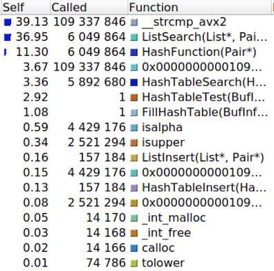

**Figure 3.**
**Function execution time.**

Now it is clear that the most time-consuming functions are ListSearch (which contains __strcmp_avx2) and HashFunction. We will optimize them.

## 4. Optimization ##

Let's measure the program execution time without optimizations with -O1 and -O3 for further comparisons.

| -O1, s   | -O3, s   |
|----------|----------|
| 4.501829 | 4.136374 |

**Table 1.**

### 4.1. __strcmp_avx2 ###

First of all, we need to optimize string comparison. There is a good solution for this - we can use AVX instructions!

And now in more detail. Note that our words do not exceed 32 bytes in size. Then we can store keywords in variables of type __m256i. Now the comparison of two strings turns into the comparison of two __m256i variables, which is performed by just one _mm256_cmpeq_epi8 instruction.

```c
  __m256i key = _mm256_loadu_si256((const __m256i*)pair->key);
  __m256i data_key = _mm256_setzero_si256();

  for (size_t i = 0; i < list->size; ++i) {
    data_key = _mm256_loadu_si256((const __m256i*)list->data[i].key);
    int result = _mm256_movemask_epi8(_mm256_cmpeq_epi8(data_key, key));

    if (result == -1) {
      pair->value = list->data[i].value;
      return true;
    }
  }
}
```

Let's measure the execution time after this optimization.

| -O1, s   | -O3, s   |
|----------|----------|
| 4.501829 | 4.136374 |
| 3.899324 | 3.763011 |

**Table 2.**

Thus, we achieved a speedup of 15% with -O1 and 10% with -O3.

### 4.2. ListSearch ###

Let's understand how the ListSearch function works. It receives a bucket and an element to be found in this bucket as input. Then it iterates through all the elements and compares them using the built-in strcmp until it finds the requested element. Thus, to optimize ListSearch, we can rewrite it in assembly using vector instructions.

```asm
_ListSearch:  mov rax, [rdi]     
              mov rcx, [rdi + 8] 

              vmovdqu ymm0, [rsi]

loop_start:   or rcx, rcx
              jz exit_false

              vmovdqu ymm1, [rax]
              vpcmpeqb ymm2, ymm1, ymm0
              vpmovmskb rdx, ymm2

              cmp rdx, -1
              je exit_true

              add rax, 16
              dec rcx
              jmp loop_start

exit_false:   xor rax, rax
              ret

exit_true:    mov rdx, [rsi + 8]
              mov [rax + 8], rdx
              mov rax, 1
              ret

```

Let's measure the execution time after this optimization.

| -O1, s   | -O3, s   |
|----------|----------|
| 3.899324 | 3.763011 |
| 3.695025 | 3.585601 |

**Table 3.**

Thus, we observed a slowdown of 6% with -O1 and 5% with -O3.

### 4.3. HashFunction ###

Now we need to optimize CRC32. For this, there is a built-in assembly instruction for calculating CRC32.  

```c
size_t HashFunction(Pair* pair) {
  size_t result = 0;

  __asm__ (
    ".intel_syntax noprefix \n\t"
    "xor rax, rax           \n\t"
    "mov rdx, [rdi]         \n\t"
    "loop_start:            \n\t"
    "mov cl, [rdx]          \n\t"
    "or cl, cl              \n\t"
    "jz loop_end            \n\t"
    "crc32 rax, cl          \n\t"
    "inc rdx                \n\t"
    "jmp loop_start         \n\t"
    "loop_end:              \n\t"
    ".att_syntax            \n\t"
    : "=a"(result)
    :
    : "rcx", "rdx", "rdi"
  );

  return result;
}
```

Let's measure the execution time after this optimization.

| -O1, s   | -O3, s   |
|----------|----------|
| 3.695025 | 3.585601 |
| 3.311672 | 3.273021 |

**Table 4.**

Thus, we achieved a speedup of 12% with -O1 and 10% with -O3.

 ## 5. Conclusion ##

  Finally, let's compare the execution time of our initial hash table (without any optimizations) and the optimized hash table.

|                                                 | -O1, s   | -O3, s   |
|-------------------------------------------------|----------|----------|
| Without optimizations                           | 4.501829 | 4.136374 |
| AVX instructions                                | 3.899324 | 3.673011 |
| ListSearch + AVX instructions                   | 3.695025 | 3.585601 |
| ListSearch + AVX instructions + optimized CRC32 | 3.311672 | 3.273021 |


**Table 5.**

As a result, I managed to increase the performance of the hash table by 36% (with -O1) and 23% (with -O3).
